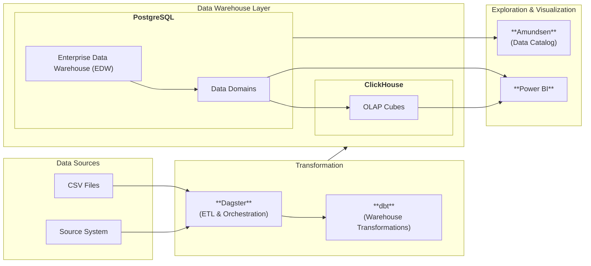

# System Architecture

This document describes the overall architecture of the system.

## Architecture Overview

The system follows a modern data warehouse architecture with clear separation of concerns:



## Components

### 1. Data Ingestion

**Dagster** serves as the orchestration engine for all data pipelines:

- Schedules and executes ETL jobs
- Monitors pipeline execution
- Manages dependencies between jobs
- Provides UI for pipeline management

**ETL Jobs** handle data extraction and loading:

- Extract data from external sources
- Transform data for storage
- Load data into core schema
- Log execution metadata

### 2. Data Storage

**PostgreSQL** is the primary data warehouse:

- **Core Schema** (`core`): Normalized operational data
  - Players, teams, matches, leagues
  - Referees, stadiums, associations
  - Player statistics and relationships
  
- **Metadata Schema** (`metadata`): ETL execution logs
  
- **Data Marts**: Dimensional models for analytics
  - `mart_match_performance`: Match-level analytics
  - `mart_player_performance`: Player-level analytics
  - `mart_team_standings`: Team rankings and standings

### 3. Data Transformation

**dbt** (data build tool) manages transformations:

- Builds dimensional models from core data
- Defines data quality tests
- Documents data lineage
- Generates documentation

Models are organized by mart:
- Match performance dimensions and facts
- Player performance dimensions and facts
- Team standings dimensions and facts

### 4. Metadata Management

**Amundsen** provides data discovery and cataloging:

- **Amundsen Metadata Service**: Manages metadata graph
- **Amundsen Search Service**: Provides search capabilities
- **Amundsen Frontend**: User interface for data discovery

**Neo4j** stores the metadata graph:
- Table and column relationships
- Data lineage
- Ownership and tags

**Elasticsearch** enables fast search:
- Indexed table and column metadata
- Full-text search capabilities
- Aggregations and filters

## Data Flow

### Ingestion Flow

1. Dagster scheduler triggers ETL job
2. ETL job extracts data from source
3. Data is transformed and validated
4. Data is loaded into core schema
5. Execution metadata is logged

### Transformation Flow

1. dbt reads from core schema
2. dbt executes transformation models
3. Dimensional tables are populated
4. Fact tables are computed
5. Data marts are refreshed

### Metadata Flow

1. Extractor reads PostgreSQL catalog
2. Metadata is loaded to Neo4j
3. Search data is indexed in Elasticsearch
4. Amundsen serves metadata to users

## Network Architecture

All services communicate via a Docker bridge network (`minerva_net`):

```
minerva_net (bridge)
├── minerva_postgres:5432
├── minerva_dagster_webserver:3000
├── minerva_dagster_daemon
├── minerva-amundsen-frontend:5000
├── minerva-amundsen-metadata:5002
├── minerva-amundsen-search:5001
├── minerva-amundsen-neo4j:7474,7687
└── minerva-elasticsearch:9200
```

Services reference each other by container name for internal communication.

## Storage Architecture

**Persistent Volumes**:

- `minerva_postgres_data`: PostgreSQL data files
- `minerva_neo4j_data`: Neo4j graph database

**Mounted Volumes**:

- `./dbt`: dbt project files (shared with Dagster)
- `./migrations`: Database initialization scripts
- `./dagster/jobs`: Standalone ETL jobs

## Scalability

The architecture supports horizontal scaling:

- **Dagster**: Add more daemon containers for parallel execution
- **Amundsen**: Scale frontend and API services independently
- **PostgreSQL**: Implement read replicas for query workloads
- **Elasticsearch**: Add nodes to cluster for search performance

## Monitoring

Key metrics to monitor:

- Dagster job execution times and failures
- PostgreSQL connection pool and query performance
- Elasticsearch cluster health and query latency
- Neo4j memory usage and query performance
- Container resource utilization (CPU, memory, disk)

